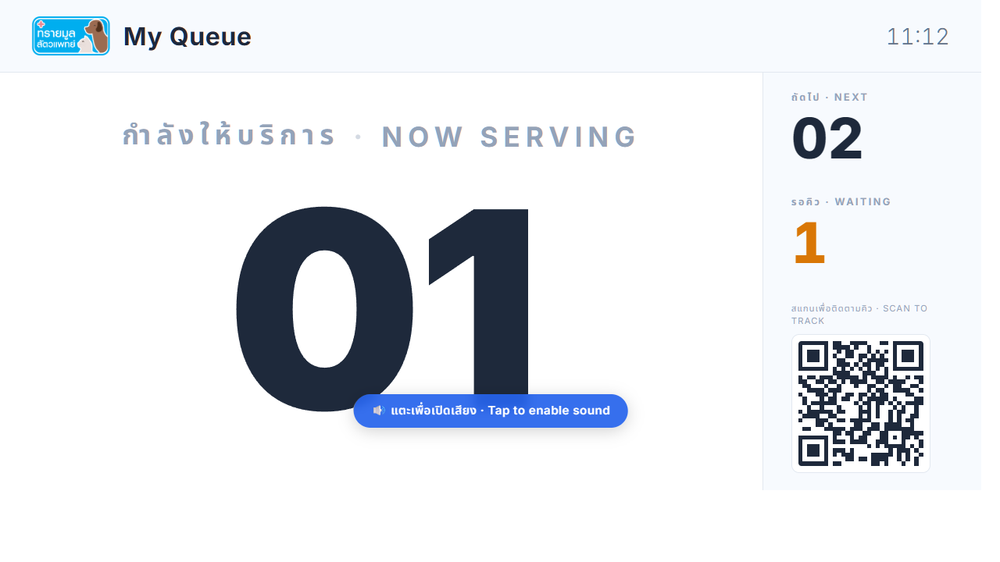
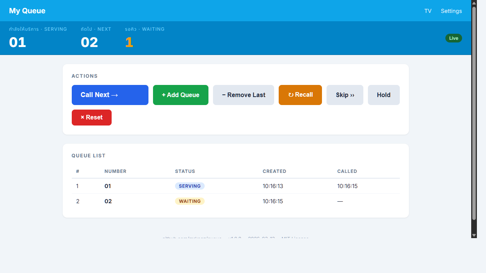
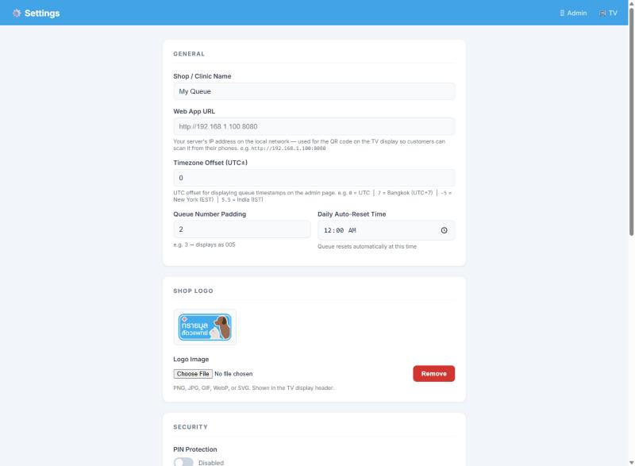
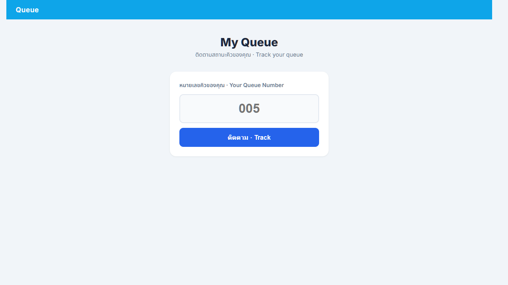

# Queue — Self-Hosted Queue Management App

A lightweight, self-hosted queue management system designed for small businesses (clinics, shops, service counters). Runs entirely in a single Docker container with no external dependencies.

---

## Features

- **TV Display Page** — Large queue number display for a wall-mounted screen or smart TV
- **Admin Page** — Operator controls to call, skip, recall, hold, and manage the queue
- **Settings Page** — Configure shop name, announcements, voice language, and more
- **Phone Status Page** — Customers scan a QR code to follow their queue on their phone
- **PWA Web Push Notifications** — Notify customers on their phone when their number is called (works in background)
- **Facebook Messenger Bot** — Customers subscribe by messaging the shop's Facebook Page; notified via Messenger when their number is called
- **Thai/English Voice Announcements** — Natural TTS via `edge-tts` (Microsoft Neural voices, no API key needed)
- **Real-time Updates** — WebSocket-powered live sync across all connected devices
- **PIN Security** — 4-digit PIN locks `/admin` and `/settings` with backend-enforced session tokens (LAN & cloud-safe)
- **SQLite** — Zero-config database, data persists via Docker volume
- **Single Docker Container** — Easy to deploy anywhere on your local network or the cloud
- **Google Analytics** — Optional GA4 tracking on all pages; enter your Measurement ID in Settings to enable
- **SEO Ready** — Dynamic page titles with shop name, Open Graph tags, `robots.txt`, and `noindex` on protected pages

---

## Pages

| Page | URL | Description |
|---|---|---|
| TV Display | `/tv` | Full-screen queue display for smart TV |
| Admin | `/admin` | Operator control panel |
| Settings | `/settings` | App configuration |
| Phone Status | `/status` | Customer-facing page via QR code |
| Statistics | `/stats` | Queue analytics — volume, outcomes, wait times, peak hours |

---

## Screenshots

**TV Display** — full-screen queue board for a wall-mounted screen or smart TV



**Admin** — operator control panel with queue list and action buttons



**Settings** — configure shop name, logo, voice, announcements, and security



**Phone Status** — customer-facing page opened by scanning the QR code on the TV



---

## Compatible Platforms

| OS / Device | Docker | Python (no Docker) |
|---|---|---|
| Windows 10/11 | ✅ Docker Desktop | ✅ Python 3.11+ |
| macOS (Intel & Apple Silicon) | ✅ Docker Desktop | ✅ Python 3.11+ |
| Linux (Ubuntu, Debian, etc.) | ✅ Docker Engine | ✅ Python 3.11+ |
| Synology NAS (x86-64 / ARM64) | ✅ Container Manager | — |

> **Architectures:** pre-built images are available for `linux/amd64` and `linux/arm64`.
>
> **Synology NAS:** The default config uses a named volume (created automatically). If you switch to a bind mount (`./data:/app/data`), create the `data` folder in File Station first.

---

## Docker Image (GHCR)

Pre-built images are published automatically to the GitHub Container Registry on every release:

```
ghcr.io/mrkaqz/queue:latest       # latest main branch
ghcr.io/mrkaqz/queue:2.3.2        # specific version
```

[](https://github.com/mrkaqz/queue/actions/workflows/docker-publish.yml)

---

## Quick Start

### Option 1 — Docker via GHCR (recommended, no git clone needed)

Create a `docker-compose.yml` anywhere on your machine:

```yaml
services:
  queue:
    image: ghcr.io/mrkaqz/queue:latest
    ports:
      - "8080:8080"
      - "8443:8443"
    volumes:
      - queue_data:/app/data   # named volume — created automatically
    restart: unless-stopped

volumes:
  queue_data:
```

Then run — no folder setup needed:

```bash
docker compose up -d
```

The app will be available at:
- **HTTP:** `http://<server-ip>:8080`
- **HTTPS:** `https://<server-ip>:8443` *(self-signed cert, required for PWA push notifications)*

> A self-signed SSL certificate is auto-generated on first run inside the container.

**To update to the latest version:**

```bash
docker compose pull && docker compose up -d
```

---

### Option 2 — Docker (build from source)

```bash
git clone https://github.com/mrkaqz/queue.git
cd queue
docker compose up -d
```

---

### Option 3 — Python directly (no Docker)

**Requirements:** Python 3.11+ — [python.org/downloads](https://www.python.org/downloads/)

#### macOS / Linux

```bash
git clone https://github.com/mrkaqz/queue.git
cd queue
python3 -m venv .venv
source .venv/bin/activate
pip install -r requirements.txt
uvicorn app.main:app --host 127.0.0.1 --port 8080 --reload
```

#### Windows (Command Prompt)

```cmd
git clone https://github.com/mrkaqz/queue.git
cd queue
python -m venv .venv
.venv\Scripts\activate
pip install -r requirements.txt
uvicorn app.main:app --host 127.0.0.1 --port 8080 --reload
```

#### Windows (PowerShell)

```powershell
git clone https://github.com/mrkaqz/queue.git
cd queue
python -m venv .venv
.venv\Scripts\Activate.ps1
pip install -r requirements.txt
uvicorn app.main:app --host 127.0.0.1 --port 8080 --reload
```

Then open `http://localhost:8080` in your browser.

---

## Usage

### TV Setup
Open `http://<server-ip>:8080/tv` in your smart TV browser and set it to fullscreen. It auto-updates via WebSocket whenever a queue number is called.

### Admin (Operator)
Open `http://<server-ip>:8080/admin` on any device. Use the controls to:

| Button | Action |
|---|---|
| **Call Next** | Advance to the next waiting number |
| **Add Queue** | Manually add a walk-in number |
| **Remove Last** | Remove the last waiting number (undo accidental add) |
| **Recall** | Re-announce the current number |
| **Skip** | Skip the current number (marks as skipped, calls next) |
| **Hold** | Put the current number on hold |
| **Reset** | Clear all queues (start of day) |

### Customer Phone
A QR code is shown on the TV page. Customers scan it to open `/status` on their phone. From there they can:
- Subscribe to **PWA push notifications** — alerted when their number is called, even with the screen off
- Tap **"Notify via Messenger"** — subscribe via Facebook Messenger with one tap (if configured)

---

## Facebook Messenger Bot

Customers can subscribe to queue notifications through Facebook Messenger — no app install or browser permission needed. They simply tap the Messenger button on the `/status` page and send their queue number.

### Customer flow
```
1. Scan QR code on TV → opens /status
2. Enter queue number → tap "Notify via Messenger"
3. Messenger opens with number pre-filled → tap Send (one tap)
4. Bot confirms: "✅ Subscribed for queue 005 — you'll be notified when called."
5. Operator calls that number → Messenger notification sent instantly
6. Subscription auto-deleted after notify
```

### Operator setup
1. Go to [developers.facebook.com](https://developers.facebook.com) → **Create App** → type **Business**
2. From the left sidebar → **Add product** → choose **Messenger** → click **Set up**
3. Under **Access Tokens** → select your Facebook Page → copy the **Page Access Token**
4. Open **Settings → Facebook Messenger Bot** in the Queue app and fill in:
   - **Page Access Token** — from step 3
   - **App Secret** — from App Settings → Basic
   - **Webhook Verify Token** — any random string you choose (e.g. `myshop_verify_2024`)
   - **Page Username** — your Facebook Page username (e.g. `myshoppage` for `m.me/myshoppage`)
5. Click **Save**, then copy the **Webhook URL** shown in the card
6. Back in Facebook App → Messenger → **Webhooks** → **Add Callback URL**
   - Callback URL: the Webhook URL from step 5
   - Verify Token: the same string from step 4
7. Click **Verify and Save** → subscribe to the **`messages`** event
8. Under **Messenger API Settings** → **Generate Token** if needed, verify the Page is connected

> **HTTPS required:** Facebook rejects self-signed certificates. Use the container's HTTPS port (`8443`) with a real domain and CA-signed cert, or tunnel with [ngrok](https://ngrok.com) for testing. Local LAN deployments without a domain cannot use this feature.

> **Dev Mode vs Live Mode:** In Dev Mode, only Facebook App admins and testers can message the bot. Switch the app to **Live Mode** for all customers to use it.

---

## Security (PIN Lock)

The `/admin` and `/settings` pages are protected by a **4-digit PIN** with backend-enforced session tokens — safe for both local network and internet/cloud deployments.

### First-time setup
On the very first visit to `/admin` or `/settings`, a **Set Up Admin PIN** screen appears. Enter and confirm a 4-digit PIN — the session is then unlocked for that browser tab.

### Returning visits
A PIN entry screen appears when no session token is found. The session is stored in `sessionStorage` — it survives page refresh within the same tab but requires re-entry in a new tab.

### Change PIN
A 🔑 button in the admin page nav opens a **Change PIN** modal. Requires the current PIN before accepting a new one.

### How it works
- PINs are stored as **SHA-256 hashes** — never plain text
- After a correct PIN entry the server issues a **Bearer token** (8-hour TTL, stored in `sessionStorage`)
- All protected API endpoints return `401 Unauthorized` without a valid token — the frontend lock cannot be bypassed by calling the API directly
- The TV display (`/tv`), customer status page (`/status`), and WebSocket are public and unaffected

---

## Voice Announcements

Voice announcements use [`edge-tts`](https://github.com/rany2/edge-tts) with Microsoft's neural voices — free, no API key required. Internet access is needed the first time a number is announced; audio is then **cached permanently** in `data/audio/`.

On startup, audio for numbers **1–100 is pre-generated in the background** so the first queue call plays instantly with no delay. The cache is automatically rebuilt whenever voice or language settings are changed.

- Thai: `th-TH-PremwadeeNeural` → *"หมายเลขคิวที่ห้า"*
- English: `en-US-JennyNeural` → *"Queue number five"*
- Bilingual: Thai followed by English

Numbers are spoken naturally — `005` is announced as *"ห้า"* (five), not *"ศูนย์ศูนย์ห้า"*.

---

## Configuration

All settings are managed through `/settings` in the UI. No config files needed.

| Setting | Default | Description |
|---|---|---|
| Shop Name | `My Queue` | Displayed on TV and admin pages |
| Web App URL | *(empty)* | LAN URL for QR code, e.g. `http://192.168.1.100:8080` |
| Queue Padding | `3` | Display format: `005` vs `5` |
| Daily Reset Time | `00:00` | Auto-reset queue at this time each day |
| Announcement Message | *(empty)* | Scrolling ticker text on TV display |
| Announcement Language | `th` | `th` / `en` / `th+en` |
| Announcement Sound | `chime` | Sound before voice: `chime` / `bell` / `beep` / `none` |
| Announcement Sound Output | `TV only` | Where audio plays: `TV only` / `Admin + TV` / `Admin only` |
| Timezone Offset | `0` | UTC offset for admin timestamps. e.g. `0` = UTC, `7` = Bangkok (UTC+7), `-5` = EST, `5.5` = IST |
| Thai Voice | `th-TH-PremwadeeNeural` | edge-tts voice for Thai |
| English Voice | `en-US-JennyNeural` | edge-tts voice for English |
| VAPID Email | *(required for push)* | Email used for Web Push VAPID keys |
| Facebook Page Access Token | *(empty)* | Page Access Token from Facebook Developer App |
| Facebook App Secret | *(empty)* | App Secret from Facebook App Settings → Basic |
| Facebook Webhook Verify Token | *(empty)* | Any string you choose; used to verify the webhook with Facebook |
| Facebook Page Username | *(empty)* | Page username for `m.me/` links, e.g. `myshoppage` |
| Google Analytics ID | *(empty)* | GA4 Measurement ID (e.g. `G-XXXXXXXXXX`). Leave empty to disable tracking. |

> **Web App URL** — set this to your server's LAN IP so the QR code on the TV points to the right address when customers scan it from their phones.

---

## Project Structure

```
queue/
├── docker-compose.yml
├── Dockerfile
├── requirements.txt
│
└── app/
    ├── main.py                  # FastAPI entry point, lifespan, routes
    ├── database.py              # SQLite setup & all DB helpers
    ├── models.py                # Pydantic data models
    ├── tts.py                   # edge-tts voice generation & file cache
    ├── number_to_words.py       # Integer → Thai/English word converter
    ├── websocket.py             # WebSocket broadcast manager
    ├── routers/
    │   ├── auth.py              # PIN auth endpoints & session token logic
    │   ├── queue.py             # Queue API endpoints
    │   ├── settings.py          # Settings API endpoints
    │   ├── push.py              # Web Push subscription endpoints
    │   ├── messenger.py         # Facebook Messenger webhook & bot logic
    │   └── stats.py             # Statistics API endpoints
    └── static/
        ├── manifest.json        # PWA manifest
        ├── sw.js                # Service Worker (push notifications)
        ├── analytics.js         # Google Analytics loader + dynamic SEO (title, OG tags)
        ├── robots.txt           # Crawler rules (blocks admin/settings/stats/api)
        ├── tv/index.html        # TV display page
        ├── admin/index.html     # Admin/operator page
        ├── settings/index.html  # Settings page
        └── status/index.html    # Customer phone page
```

---

## API Reference

> **Auth:** endpoints marked 🔒 require `Authorization: Bearer <token>` — obtain a token via `POST /api/auth/verify-pin`. Unmarked endpoints are public.

### Authentication

| Method | Endpoint | Auth | Description |
|---|---|---|---|
| `GET` | `/api/auth/status` | Public | Check whether a PIN is configured |
| `POST` | `/api/auth/set-pin` | Public | Set the PIN for the first time |
| `POST` | `/api/auth/verify-pin` | Public | Verify PIN → returns session token |
| `POST` | `/api/auth/change-pin` | 🔒 | Change PIN (verifies current PIN first) |

### Queue

| Method | Endpoint | Auth | Description |
|---|---|---|---|
| `GET` | `/api/queue/status` | Public | Current number, next, and waiting count |
| `GET` | `/api/queue/list` | 🔒 | Full queue list for today |
| `POST` | `/api/queue/add` | 🔒 | Add next queue number |
| `POST` | `/api/queue/call-next` | 🔒 | Call next waiting number |
| `POST` | `/api/queue/recall` | 🔒 | Re-announce current number |
| `POST` | `/api/queue/skip` | 🔒 | Skip current number |
| `POST` | `/api/queue/hold` | 🔒 | Put current number on hold |
| `POST` | `/api/queue/remove-last` | 🔒 | Remove the last waiting number |
| `POST` | `/api/queue/reset` | 🔒 | Reset all queues |

### Settings

| Method | Endpoint | Auth | Description |
|---|---|---|---|
| `GET` | `/api/settings/public` | Public | Get non-sensitive settings (`shop_name`, `google_analytics_id`) |
| `GET` | `/api/settings` | 🔒 | Get all settings |
| `PUT` | `/api/settings` | 🔒 | Update settings |
| `POST` | `/api/settings/logo` | 🔒 | Upload shop logo |
| `DELETE` | `/api/settings/logo` | 🔒 | Remove shop logo |

### Push Notifications

| Method | Endpoint | Auth | Description |
|---|---|---|---|
| `GET` | `/api/push/vapid-key` | Public | Get public VAPID key |
| `POST` | `/api/push/subscribe` | Public | Register device for push |
| `POST` | `/api/push/unsubscribe` | Public | Remove device subscription |

### Messenger Bot

| Method | Endpoint | Auth | Description |
|---|---|---|---|
| `GET` | `/api/messenger/webhook` | Public | Facebook webhook verification challenge |
| `POST` | `/api/messenger/webhook` | Public (HMAC-signed) | Receive Messenger events from Facebook |

### Statistics

| Method | Endpoint | Auth | Description |
|---|---|---|---|
| `GET` | `/api/stats/daily` | 🔒 | Hourly breakdown for a date (default: today) |
| `GET` | `/api/stats/monthly` | 🔒 | Daily breakdown for a year/month (default: current) |
| `GET` | `/api/stats/yearly` | 🔒 | Monthly breakdown for a year (default: current) |

### WebSocket

Connect to `ws://<server>:8080/ws` for real-time events.

```json
{ "event": "init",             "status": {...}, "shop_name": "My Queue" }
{ "event": "queue_called",     "current": "005", "next": "006", "waiting": 12, "audio_urls": [...] }
{ "event": "queue_added",      "number": "018",  "waiting": 13 }
{ "event": "queue_recalled",   "current": "005", "audio_urls": [...] }
{ "event": "queue_skipped",    "current": "006", "waiting": 11 }
{ "event": "queue_held",       "held": "005" }
{ "event": "queue_removed",    "number": "018",  "waiting": 12 }
{ "event": "queue_reset" }
{ "event": "settings_updated", "shop_name": "My Clinic", "announcement_message": "..." }
```

---

## PWA & Push Notifications

Web Push requires HTTPS. The container auto-generates a self-signed certificate on first run.

- **Android (Chrome):** native "Allow notifications" prompt
- **iOS (Safari 16.4+):** customer must **Add to Home Screen** first, then enable notifications

---

## Tech Stack

| Layer | Technology |
|---|---|
| Backend | [FastAPI](https://fastapi.tiangolo.com/) (Python 3.11) |
| Database | SQLite via `aiosqlite` |
| Real-time | WebSockets |
| TTS | [edge-tts](https://github.com/rany2/edge-tts) |
| Push | Web Push API + `pywebpush` |
| Messenger | Facebook Messenger Platform (Graph API v20) |
| Frontend | Vanilla HTML / CSS / JavaScript |
| Container | Docker + Docker Compose |

---

## Releases

### v2.4.0 — 2026-03-21

**New feature — Loyverse POS Integration**

- Completing a sale in Loyverse POS automatically advances the queue — no manual "Call Next" needed.
- **Smart mode** (default): calls next waiting patient; if queue is empty, auto-issues a new number and calls it immediately (walk-in support).
- **Call-next-only mode**: advances only if a patient is already waiting; does nothing if the queue is empty.
- HMAC-SHA256 signature verification (`X-Loyverse-Webhook-Signature`) keeps the endpoint secure.
- Configurable from the Settings page: webhook secret, enable/disable toggle, and behaviour selector.
- Webhook URL auto-generated in Settings → Loyverse POS Integration → copy and paste into Loyverse dashboard.

#### Docker

```bash
docker pull ghcr.io/mrkaqz/queue:2.4.0
```

Or pin in `docker-compose.yml`:

```yaml
image: ghcr.io/mrkaqz/queue:2.4.0
```

---

### v2.3.2 — 2026-03-16

**Bug fixes**

- **TV sound badge hidden on Admin-only audio** — when Announcement Sound Output is set to "Admin only", the TV page no longer shows the "Tap to enable sound" badge since audio never plays there. The badge also reacts instantly when the setting is changed via WebSocket — no TV page reload needed.

#### Docker

```bash
docker pull ghcr.io/mrkaqz/queue:2.3.2
```

Or pin in `docker-compose.yml`:

```yaml
image: ghcr.io/mrkaqz/queue:2.3.2
```

---

### v2.3.1 — 2026-03-16

**Bug fixes & polish**

- **TV sound badge auto-hide** — the "Tap to enable sound" banner now disappears automatically after 15 minutes if no one taps it, so it never clutters the TV display overnight or after setup.

#### Docker

```bash
docker pull ghcr.io/mrkaqz/queue:2.3.1
```

Or pin in `docker-compose.yml`:

```yaml
image: ghcr.io/mrkaqz/queue:2.3.1
```

---

### v2.3.0 — 2026-03-15

**Google Analytics & SEO**

- **Google Analytics 4** — enter a GA4 Measurement ID (`G-XXXXXXXXXX`) in Settings to enable tracking across all pages. Leave the field empty to disable completely (no external requests made).
- **Dynamic page titles** — browser tab and OG title automatically include the shop name (e.g. *"My Clinic — Queue Display"*).
- **Open Graph tags** — `og:title`, `og:description`, and `og:url` injected on TV and status pages for rich social previews.
- **`robots.txt`** — served at `/robots.txt`; blocks crawlers from `/admin`, `/settings`, `/stats`, and `/api/`. TV and status pages are open to indexing.
- **`noindex` on protected pages** — admin, settings, and stats pages include `<meta name="robots" content="noindex, nofollow">`.
- **New public endpoint** — `GET /api/settings/public` returns `shop_name` and `google_analytics_id` without authentication.

#### Docker

```bash
docker pull ghcr.io/mrkaqz/queue:2.3.0
```

Or pin in `docker-compose.yml`:

```yaml
image: ghcr.io/mrkaqz/queue:2.3.0
```

---

### v2.2.3 — 2026-03-14

Maintenance release — bug fixes and stability improvements.

#### Docker

```bash
docker pull ghcr.io/mrkaqz/queue:2.2.3
```

---

## License

MIT — free to use, modify, and self-host.
